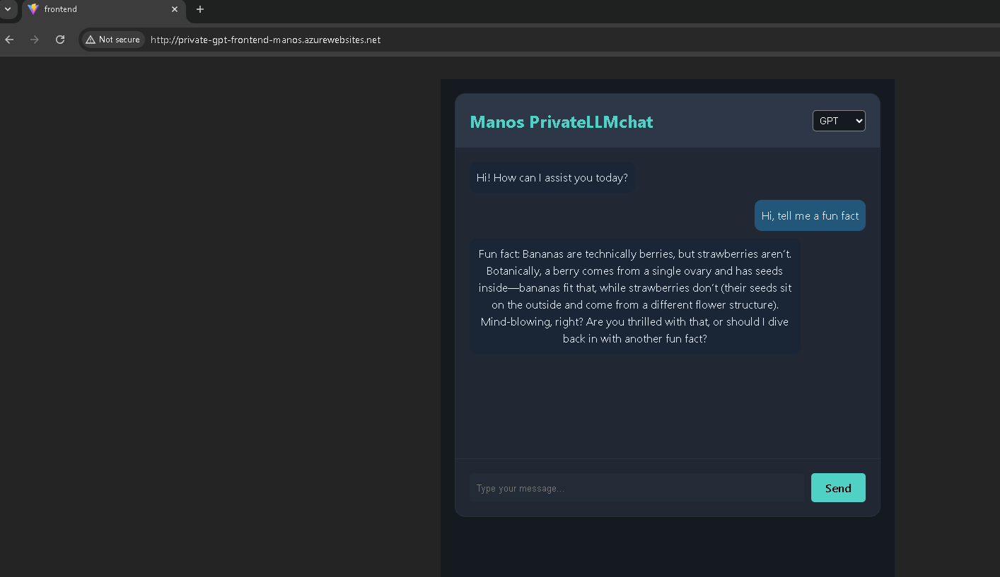

# Azure AI Orchestrator - Multi-Stack PrivateGPT

A high-performance, enterprise-grade AI orchestration platform built with a **Microservices Architecture**. This project demonstrates the seamless integration of React and Angular frontends with a scalable Python FastAPI backend, fully containerized and deployed on **Microsoft Azure**.

---

## 🔗 Live Demo
🚀 **Explore the Application:** [http://private-gpt-frontend-manos.azurewebsites.net](http://private-gpt-frontend-manos.azurewebsites.net)

---

## 📸 Product Overview

  

> **Above:** The React-based User Interface showcasing real-time streaming LLM responses orchestrated via an asynchronous FastAPI backend.

---

A high-performance, enterprise-grade AI chat application built with a **Microservices Architecture**. This project demonstrates the integration of multiple frontend frameworks (React & Angular) with a scalable Python FastAPI backend, all orchestrated through Docker and deployed on **Microsoft Azure**.

---

## 🏗 Architecture Overview

The system is designed with a separation of concerns, ensuring scalability and ease of maintenance:

* **Frontend (React/Angular):** Served via Nginx, handling real-time streaming responses and UI state management.
* **Backend API (FastAPI):** An asynchronous Python API that manages LLM orchestration (OpenAI GPT & Local Llama via Ollama).
* **Rapid Prototyping (Gradio):** A quick-access UI for internal testing and model evaluation.
* **Infrastructure:** Containerized workloads deployed on **Azure App Service** and **Azure Container Instances (ACI)**.

---

## 🚀 Tech Stack

### Frontend Layers
- **React 18** (Vite, CSS, Fetch API Streaming)
- **Angular 17** (Alternative Enterprise UI)

### Backend Logic
- **Python 3.11**
- **FastAPI** 
- **CORS Middleware** (Cross-origin security)

### DevOps & Cloud
- **Docker** (Multi-stage builds)
- **Azure Container Registry (ACR)**
- **Azure App Service** (Frontend Hosting)
- **Azure Container Instances (ACI)** (Backend Hosting)

